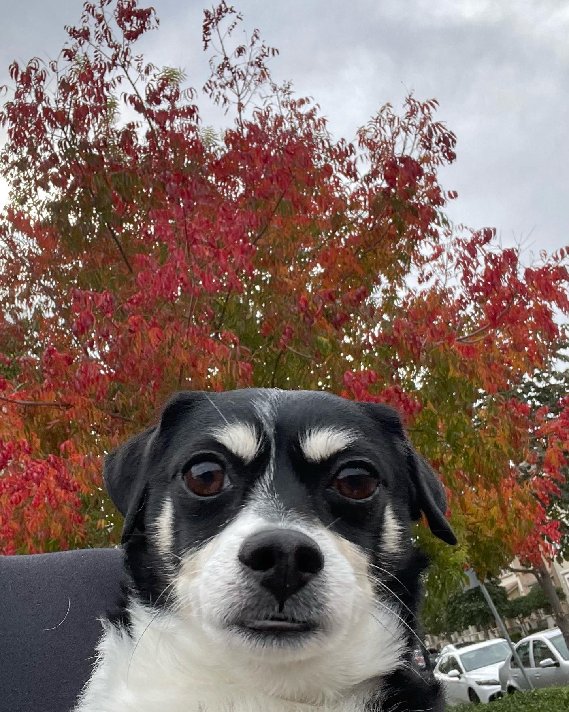

# CMPM120-D1
## It's a Doggy Dog World Out There

Some say that it's a dog eat dog world out there, but perhaps it's doggy dog world instead &#x1f914;

#### Tech

- vanilla js
- Phaser3 found <a href="https://newdocs.phaser.io/docs/3.60.0"> here </a>

#### About

This is a demo for my Computation Media - Game Development Experience course @ UCSC
4/26/23

#### Credits

All dog related assets stolen from my dogs Riki and Betty then mutilated by yours truly. 

Hover sound effect asset made by me flicking a soda can tab and then editing the audio.

Dog audio may or may not have been lowered (Don't tell Riki).

Adam Smith photo taken from Wikipedia. 

UCSC logo taken from school website. 

Logotypes made using Adobe Express.
## Demo
<a href="https://anranlee99.github.io/CMPM120-D1/"> here </a>